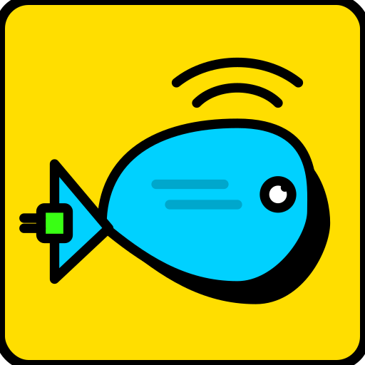

<div align="center">
  

# 🌐 Web2Agent

**A Manifest V3 Chrome Extension orchestrating AI models & MCP tools natively in your browser.**

[](#)
[](#)
[](#)
[](#)

[Features](#-key-features) •
[Installation](#-installation--quick-start) •
[Architecture](#%EF%B8%8F-architecture) •
[Troubleshooting](#-troubleshooting)
</div>

---

## 🌟 About The Project

`Web2Agent` is a powerful Manifest V3 Chrome extension that bridges your web browser, popular AI Chat interfaces (ChatGPT, Gemini), and the **Model Context Protocol (MCP)**. 

With Web2Agent, you can chat with advanced LLMs while wielding any MCP server—local or remote. It injects seamless tool-execution UI directly into your favorite AI chatting platforms, manages a robust "Skill" system, and offloads heavy workflows into background processes to create a true agentic workflow.

### 📸 Screenshots

<p align="center">
  
  
  
  
  
  
  <br/>
  
</p>

### ✨ Key Features

- **MCP Protocol Integrations**: Connect seamlessly to both HTTP MCP servers (directly from the browser) and local `stdio` MCP servers (through a native messaging desktop companion).
- **Agentic Execution Loop**: Monitors AI outputs for structured tool calls, automatically executes tools in the background, and seamlessly injects the results back into your chat conversation.
- **Native Chat Interceptors**: Overlays clean, interactive tool execution cards directly inside ChatGPT and Gemini's native web UIs.
- **Persistent Side Panel**: Offers a full-featured, persistent workspace inside Chrome acting as your command center for MCP config, logs, and deep AI interactions.
- **AI Skill Management**: Define, toggle, and inject contextual "Skills" directly into chat orchestrators.
- **Secure Architecture**: Implements encrypted config storage, redaction of sensitive credentials, and connection health discovery.

---

## 🏗️ Architecture

The project is split into two harmonized runtimes:

### 1. Chrome Extension Runtime
The core of Web2Agent runs securely within your browser.
- **`src/options/`**: Full-page configuration console for managing MCP servers.
- **`src/popup/`**: Compact status overview and quick-action surface.
- **`src/sidepanel/`**: Persistent multimodal workspace shell.
- **`src/content/`**: Content scripts handling UI injections (e.g., inside ChatGPT/Gemini) and page interaction.
- **`src/background/`**: Service worker bootstrapping messaging and maintaining the connection manager.
- **`src/core/`**: Core logic including MCP transports, storage hooks, and AI model adapters.

### 2. Desktop Companion Runtime
Bridges the browser boundary to execute local `stdio` MCP servers (like `uvx mcp-atlassian`).
- **`companion/src/native-host/`**: Chrome Native Messaging bridge.
- **`companion/src/process-manager/`**: Child process lifecycle, logging, and diagnostics.
- **`companion/src/mcp/`**: JSON-RPC over `stdio` transport.

*Native host ID:* `com.myworkflowext.native_bridge`

---

## 🛠 Prerequisites

Ensure you have the following installed before getting started:
- **Node.js** (v20+)
- **Yarn** (v1.x)
- **Google Chrome**

*For running local `stdio` MCP servers via the companion:*
- Any runtime requirements for your specific servers (e.g., Python `uvx` for the Atlassian preset).

---

## 🚀 Installation & Quick Start

### 1. Build the Extension

Clone the repository and install dependencies for both the extension and the desktop companion:

```bash
# Install root dependencies
yarn

# Install companion dependencies
(cd companion && yarn)
```

Build the project:

```bash
yarn build
(cd companion && yarn build)
```

### 2. Load into Chrome

1. Open Chrome and navigate to `chrome://extensions`.
2. Enable **Developer mode** in the top right corner.
3. Click **Load unpacked** and select the `dist/` folder in the project root.

*(If you only plan to use remote HTTP MCP servers, you are ready to go!)*

### 3. Install the Desktop Companion (For local MCP servers)

To run local `stdio` MCP servers, you must install the desktop companion bridge.

**macOS:**
```bash
# Locate your extension ID in chrome://extensions first
bash companion/scripts/install-macos-manual.sh --extension-id <YOUR_EXTENSION_ID>
```

**Windows:**
```powershell
# In PowerShell (run as Administrator if needed)
powershell -ExecutionPolicy Bypass -File .\companion\scripts\install-windows-manual.ps1 -ExtensionId <YOUR_EXTENSION_ID>
```

> **Note:** Always remember to reload the extension in Chrome after installing or updating the companion.

---

## 💻 Development Mode

To run a live development server with Hot Module Replacement (HMR):

```bash
yarn dev
```

- When running `yarn dev`, load the unpacked `.dev-dist/` folder into Chrome instead of `dist/`.
- This ensures development outputs do not overwrite testing/production builds.

---

## ⚙️ Example Configurations

Manage your servers inside the Extension's Options Page. 

### Local Server via Companion (e.g., Atlassian)
```json
{
  "mcpServers": {
    "mcp-atlassian": {
      "command": "uvx",
      "args": ["mcp-atlassian"],
      "stdioProtocol": "json-lines",
      "env": {
        "JIRA_URL": "https://your-domain.atlassian.net",
        "JIRA_USERNAME": "you@example.com",
        "JIRA_API_TOKEN": "your_jira_api_token"
      },
      "preset": "atlassian"
    }
  }
}
```

### Remote HTTP MCP Server
```json
{
  "mcpServers": {
    "remote-server": {
      "transport": "streamable-http",
      "url": "https://example.com/mcp",
      "headers": {
        "Authorization": "Bearer your_token"
      }
    }
  }
}
```

---

## 🐛 Troubleshooting

| Error | Common Causes & Solutions |
|-------|--------------------------|
| \`Companion connection disconnected\` | The native host is not installed, the ID inside the manifest is wrong, or the extension needs a manual reload. |
| \`Failed to start MCP command...\` | The executable (like \`uvx\`) is not in your system PATH visible to Chrome. Try using absolute paths in the config. |
| \`MCP request timed out: initialize\` | Often a stdio framing mismatch. For \`mcp-atlassian\`, ensure \`stdioProtocol\` is explicitly set to \`"json-lines"\`. |
| \`tools: 0\` | Transport succeeded but the server exposed no tools. Verify API keys, environment variables, or server-side filtering logic. |

---

## 📂 Repository Structure

```text
.
├── companion/          # Desktop native messaging bridge
├── docs/               # Architecture design & implementation specs
├── scripts/            # CLI utilities and packaging tools
├── src/
│   ├── background/     # Service worker & MCP connection pool
│   ├── content/        # UI Injectors (ChatGPT, Gemini interfaces)
│   ├── core/           # Protocol transports, State management
│   ├── options/        # React Options Page (Config console)
│   ├── popup/          # React Popup Page (Quick actions)
│   ├── sidepanel/      # React Side Panel Workspace
│   └── shared/         # Shared utilities and types
├── manifest.config.ts  # MV3 Manifest generator
├── package.json
└── vite.config.ts
```

For a deeper dive into our planned features and technical specs, check out the `docs/implementation-plan/web2agent/` folder.

---

## 🤝 Contributing

Contributions are what make the open-source community such an amazing place to learn, inspire, and create. Any contributions you make are **greatly appreciated**.

1. Fork the Project
2. Create your Feature Branch (\`git checkout -b feature/AmazingFeature\`)
3. Commit your Changes (\`git commit -m 'Add some AmazingFeature'\`)
4. Push to the Branch (\`git push origin feature/AmazingFeature\`)
5. Open a Pull Request

---

## 📄 License

Distributed under the MIT License. See \`LICENSE\` for more information.
